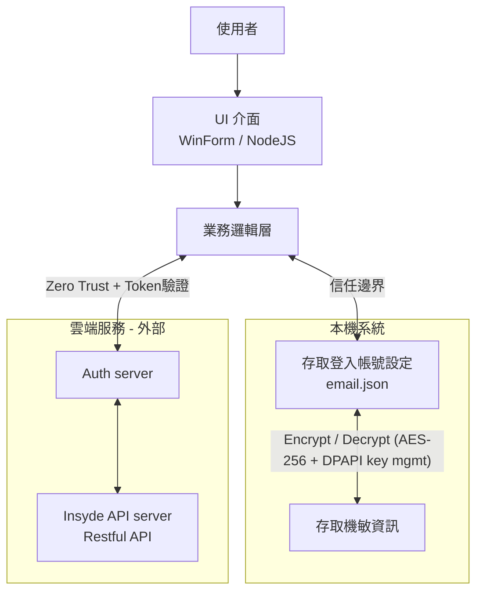

# Windows Applications Threat model review

## Revision

| Revision | Date | Description |
| --- | --- | --- |
| 0.1 | 2025/09/09 | Initial version |
| 0.2 | 2025/09/08 | Added assumptions, extended STRIDE threats, improved mitigations, added residual risk and validation steps |

## 1. 概述與範圍

*   應用程式名稱: H2OIDE, InQuire
*   應用程式描述: H2OIDE 是一款運行於 Microsoft Windows 10/11 作業系統上的整合式 BIOS 開發環境。它提供基本的文字編輯功能、編譯程式碼以及提供 BIOS CVE 漏洞解決方案下載；InQuire 則是整合 Insyde 對外所有服務的統一入口的桌面應用軟體。
*   建模範圍:
	+   包含: 應用程式本身 (.exe)、使用者設定檔、本機儲存的檔案、與作業系統的互動（檔案系統、登錄檔）、以及（若適用）與遠端雲端服務的網路通訊。
	+   排除: 用於分發的網站、第三方安裝程式（如 InnoSetup, MSI）、作業系統核心本身的漏洞。(**註記**: 若安裝程式遭竄改，可能間接影響應用初始檔案權限或 DLL。)
*   建模目標: 識別並緩解在設計與開發階段可能出現的安全威脅，保護使用者資料的機密性、完整性和可用性。
*   假設條件: 使用者 OS 環境無 rootkit、未遭惡意系統核心漏洞利用。

## 2. 系統架構圖



*   元件說明:
	+   使用者: 與應用程式互動的實體。
	+   UI 介面 (WinForms/NodeJS): 應用程式的主要使用者介面。
	+   業務邏輯層: BIOS 原始碼編輯、編譯；版本控制；視覺化開發元件；服務登入流程控制。
	+   本機資料儲存:
		-   信任邊界: 從應用程式進程到需要使用者帳戶登入的功能。
		-   資料流: 應用程式透過 Windows API 讀寫檔案系統（儲存文件。
	+   雲端服務:
		-   零信任: 任一次存取都需要帶入帳號密碼以及token.
		-   資料流: 應用程式透過 HTTPS 與 API 通訊，Request 與 Response 的內文都經過加密處理。

## 3. 威脅識別 (使用 STRIDE 模型)

| 威脅類型 | 目標元件 | 威脅描述 | 潛在影響 |
| --- | --- | --- | --- |
| Spoofing (假冒) | 雲端服務 | 攻擊者偽造雲端服務端點，誘使應用程式將敏感資料傳送到惡意伺服器。 | 憑證與文件資料洩露。 |
| Spoofing (假冒) | 本機 UI | 假 UI 或惡意程式模仿登入介面，誘使用戶輸入憑證。 | 憑證洩露。 |
| Tampering (竄改) | 本機資料儲存 | 設定檔或 DLL 遭修改。 | 程式行為改變，可能執行惡意程式碼。 |
| Tampering (竄改) | 本機檔案 | 使用者文件遭竄改。 | 資料完整性喪失。 |
| Tampering (竄改) | 網路資料流 | MITM 修改上傳/下載檔案。 | 使用者資料被竄改或植入惡意程式。 |
| Repudiation (否認) | 業務邏輯層 | 缺乏操作日誌。 | 無法稽核或問責。 |
| Repudiation (否認) | 雲端服務 | 缺乏雲端操作記錄（如檔案下載）。 | 難以追蹤可疑活動。 |
| Information Disclosure (資訊揭露) | 本機資料儲存 | 明文保存 API 金鑰。 | 資料洩露。 |
| Information Disclosure (資訊揭露) | 記憶體 | 敏感資料未清除。 | 敏感資訊洩露。 |
| Information Disclosure (資訊揭露) | Log | Log 檔誤記敏感資訊。 | 憑證/Token 洩露。 |
| Denial of Service (阻斷服務) | 業務邏輯層 | 開啟超大檔案導致記憶體耗盡。 | 應用崩潰。 |
| Denial of Service (阻斷服務) | Parser/Regex | 惡意輸入觸發無限迴圈或 Regex DoS。 | 系統卡死，服務不可用。 |
| Elevation of Privilege (權限提升) | DLL/設定檔載入 | DLL 挾持。 | 取得管理員權限。 |
| Elevation of Privilege (權限提升) | 系統安裝 | UAC bypass (需寫入系統目錄)。 | 高權限取得。 |

## 4. 威脅緩解與對策

| 威脅ID | 威脅描述 | 緩解措施與安全控制 | 嚴重性 (H/M/L) | 殘餘風險 |
| --- | --- | --- | --- | --- |
| S-01 | 假冒雲端服務 | 嚴格憑證驗證與憑證釘選；加入憑證更新與備援策略。 | H | 若使用者忽略更新，仍有風險。 |
| S-02 | 假 UI 偽裝 | UI 需清楚品牌識別；避免不必要的 NodeJS 界面權限。 | M | 社交工程仍可能成功。 |
| T-01 | 設定檔/DLL 篡改 | 主要執行檔與 DLL 簽章；設定檔加密與雜湊檢查。 | M | 簽章驗證若未更新，風險存在。 |
| T-02 | 檔案竄改 | 儲存於受控目錄；敏感檔案加密並保存雜湊值。 | M | Windows 預設權限弱，需額外防護。 |
| T-03 | 網路傳輸篡改 | TLS 1.3 + HSTS，避免弱密碼組合。 | H | CA 妥協仍可能影響。 |
| R-01 | 缺乏日誌 | 使用 log4net/NLog，安全位置保存。 | M | Log 可能仍遭刪除。 |
| R-02 | 缺乏雲端稽核 | 雲端端點需保存操作日誌並可查詢。 | M | 若日誌未集中管理，仍有限。 |
| I-01 | 明文保存敏感資料 | 使用 DPAPI 或 Credential Manager；金鑰輪替。 | H | 若為多使用者電腦，存取隔離有限。 |
| I-02 | 記憶體資料洩露 | 使用 SecureString，及時清除 buffer。 | M | 記憶體傾印仍有風險。 |
| I-03 | Log 洩露 | 遮罩或避免輸出敏感資訊；必要時加密 log。 | M | 誤設 log 級別仍可能洩露。 |
| D-01 | 大檔案攻擊 | 檢查大小、副檔名，串流處理。 | M | 高度併發仍可能 DoS。 |
| D-02 | Regex DoS | 使用安全 parser 或限制 regex。 | M | 特殊輸入仍可能卡死。 |
| E-01 | DLL 挾持 | 使用 SetDefaultDllDirectories；絕對路徑載入；避免管理員執行。 | H | 舊 DLL 未更新仍有風險。 |
| E-02 | UAC bypass | 僅在必要時要求系統目錄寫入；遵守 UAC 原則。 | H | 使用者同意仍可能導致高權限攻擊。 |

## 5. 驗證與後續步驟

*   程式碼審查: 聚焦 High 嚴重性威脅（S-01, T-03, I-01, E-01, E-02）。
*   滲透測試: 模擬 DLL 篡改、中間人攻擊、UAC bypass。
*   Fuzz Testing: 測試惡意輸入與 parser/regex。
*   第三方依賴掃描: npm audit, NuGet audit。
*   定義成功標準: CI pipeline 中不得有 High 等級未解決 findings。

### 5.1 程式碼自我檢查方向

1) 機敏資料別明文，改用 DPAPI [I-01 資訊揭露]  
```csharp
using System.Security.Cryptography;

byte[] plain = System.Text.Encoding.UTF8.GetBytes(secret);
byte[] cipher = ProtectedData.Protect(plain, optionalEntropy: null, scope: DataProtectionScope.CurrentUser);
// 存 cipher；需要時再 Unprotect
```

2) HTTPS／TLS：不要硬編碼 TLS 版本  
	- 讓 .NET 依 OS 原生策略協商（避免寫死 ServicePointManager.SecurityProtocol [S-01 假冒 / I-01 資訊揭露]）。
	- 運維層僅接受 TLS 1.2+ [S-01 假冒 / I-01 資訊揭露]。  
	- Node TLS 可設定 minVersion: 'TLSv1.2'。

3) 記錄（Log）可稽核且不落機敏  
	- 用 EventSource [R-01 否認]，自訂事件，避免把 Token/密碼寫進 log。

4) 編譯/連結安全選項（x64 尤其要開）  
	- /GS [E-01 權限提升 / T-01 竄改], /guard:cf [E-01 權限提升], /DYNAMICBASE [E-01 權限提升], /HIGHENTROPYVA [E-01 權限提升]  
	- 用 BinSkim 在 CI 自動掃二進位。

5) 原始碼安全掃描  
	- 在 VS Code / GitHub Actions 佈署 DevSkim [一般性檢測]。

6) HTTP 頭與常見保護  
	- 使用 helmet()，安全 Cookie (Secure, HttpOnly, SameSite)，建議設定 CSP 以避免 XSS-like 攻擊。

7) 日誌最小化、避免機敏內容  
	- 避免在 log 中輸出 Authorization header / token。

**範例（Express）**
```ts
import express from "express";
import helmet from "helmet";

const app = express();
app.use(helmet() [T-01 竄改 / I-01 資訊揭露]);
app.use(express.json());

app.get("/health", (_, res) => res.send("ok"));

app.post("/token/use", (req, res) => {
  const { userId } = req.body;
  console.info({ evt: "token_use", userId });
  res.sendStatus(204);
});

app.listen(3000);
```

## PR / CI 檢查清單

**C# / .NET**
- [ ] DPAPI [I-01] 已使用 `ProtectedData` 加密保存
- [ ] 未寫死 SecurityProtocol [S-01/T-03] 或 SslProtocols
- [ ] EventSource [R-01] 已遮罩機敏欄位
- [ ] /GS, /guard:cf, /DYNAMICBASE, /HIGHENTROPYVA [E-01] 已開；BinSkim 通過
- [ ] DevSkim [一般性檢測] PR 掃描無 High 規則

**Node / Express**
- [ ] 僅接受 TLS 1.2+/TLS 1.3 [S-01/T-03]
- [ ] 使用 helmet() 與 CSP [T-01/I-03]；安全 Cookie 設定
- [ ] Log 已遮罩敏感欄位 [I-03]
