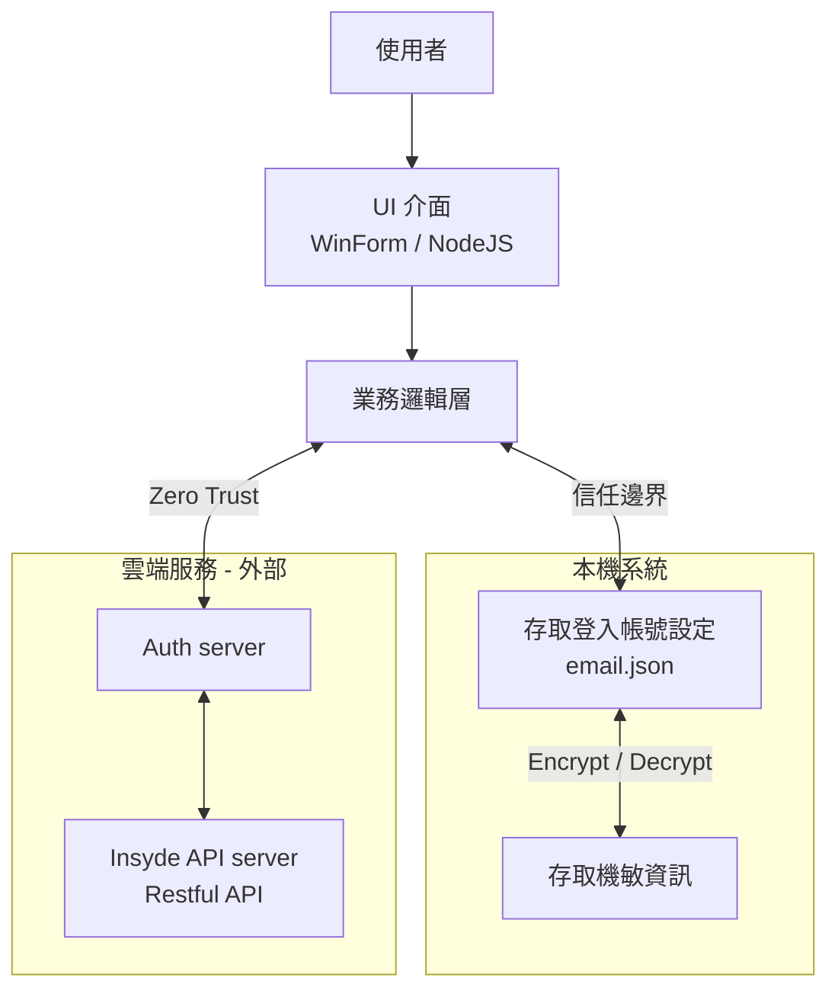

# Windows Applications Threat model review

## Revision

| Revision | Date | Description |
| --- | --- | --- |
| 0.1 | 2025/09/09 | Initial version |

## 1. 概述與範圍

*   應用程式名稱: H2OIDE, InQuire
*   應用程式描述: H2OIDE 是一款運行於 Microsoft Windows 10/11 作業系統上的整合式BIOS開發環境。它提供基本的文字編輯功能、編譯程式碼以及提供 BIOS CVE 漏洞解決方案下載；InQuire 則是整合 Insyde 對外所有服務的統一入口的桌面應用軟體。
*   建模範圍:
	+   包含: 應用程式本身 (.exe)、使用者設定檔、本機儲存的檔案、與作業系統的互動（檔案系統、登錄檔）、以及（若適用）與遠端雲端服務的網路通訊。
	+   排除: 用於分發的網站、第三方安裝程式（如 InnoSetup, MSI）、作業系統核心本身的漏洞。
*   建模目標: 識別並緩解在設計與開發階段可能出現的安全威脅，保護使用者資料的機密性、完整性和可用性。

## 2. 系統架構圖



*   元件說明:
	+   使用者: 與應用程式互動的實體。
	+   UI 介面 (WinForms/WPF/WinUI): 應用程式的主要使用者介面。
	+   業務邏輯層: 處理編輯操作、檔案格式轉換等核心功能。
	+   本機資料儲存:
		-   信任邊界: 從應用程式進程到作業系統核心。
		-   資料流: 應用程式透過 Windows API 讀寫檔案系統（儲存文件 .txt, .custom）和登錄檔（儲存使用者偏好設定）。
	+   雲端服務 (未來版本):
		-   信任邊界: 從使用者機器到網際網路。
		-   資料流: 應用程式透過 HTTPS 與 api.cloudstorage.com 通訊，以上傳/下載使用者文件。

## 3. 威脅識別 (使用 STRIDE 模型)

| 威脅類型 | 目標元件 | 威脅描述 | 潛在影響 |
| --- | --- | --- | --- |
| Spoofing (假冒) | 雲端服務 | 攻擊者偽造雲端服務的端點（DNS 快取毒害、偽造憑證），誘使應用程式將敏感資料傳送到惡意伺服器。 | 使用者憑證和文件資料洩露。 |
| Tampering (竄改) | 本機資料儲存 | 攻擊者或惡意軟體可以修改應用程式的設定檔（.config）或動態連結庫（DLL），從而改變應用程式的行為。 | 應用程式執行惡意程式碼、設定被惡意修改。 |
| Tampering (竄改) | 本機資料檔案 | 使用者儲存的檔案（.txt）可能被其他過程或惡意軟體修改，導致資料完整性喪失。 | 使用者文件內容被竄改或破壞。 |
| Repudiation (否認) | 業務邏輯層 | 應用程式沒有記錄重要操作（例如「誰」在「何時」修改了某個檔案）的日誌。 | 發生安全事件時，無法進行鑑識分析與問責。 |
| Information Disclosure (資訊揭露) | 本機資料儲存 | 應用程式將敏感資料（如雲端服務的 API 金鑰）以明文形式儲存在設定檔或登錄檔中。 | 其他使用者或惡意軟體可讀取這些敏感資訊。 |
| Information Disclosure (資訊揭露) | 程序記憶體 | 應用程式在記憶體中處理敏感資料（如密碼）後未及時清空，導致其他過程可能透過記憶體傾印讀取到該資料。 | 敏感資料洩露。 |
| Denial of Service (阻斷服務) | 業務邏輯層 | 應用程式在開啟檔案時未檢查檔案大小，攻擊者提供一個極大的檔案（如 10GB），導致應用程式耗盡所有記憶體而崩潰。 | 應用程式無法正常執行，影響可用性。 |
| Elevation of Privilege (權限提升) | 與 OS 互動的介面 | 應用程式以高權限（管理員）執行，但其載入的 DLL 或讀取的設定檔位於使用者可寫入的目錄中，攻擊者可以透過 DLL 挾持或設定檔篡改來獲取管理員權限。 | 攻擊者獲得系統的最高控制權。 |

## 4. 威脅緩解與對策

| 威脅ID | 威脅描述 | 緩解措施與安全控制 | 嚴重性 (H/M/L) |
| --- | --- | --- | --- |
| S-01 | 假冒雲端服務 | 嚴格證書驗證: 在程式碼中實現嚴格的 TLS/SSL 憑證鎖定（Certificate Pinning），而不僅僅是依賴作業系統的信任儲存。 | H |
| T-01 | 竄改設定檔或 DLL | 數位簽章與完整性檢查: 對應用程式的主要執行檔和關鍵 DLL 進行數位簽章。使用 Windows 的 SignTool 進行驗證。對設定檔進行雜湊檢查，或在儲存時進行加密與簽章。 | M |
| T-02 |竄改本機資料檔案 | 作業系統權限控制: 引導使用者將檔案儲存在受控的目錄（如 Documents 資料夾），並依賴 Windows 內建的使用者權限模型來保護檔案。對於高度敏感的檔案，考慮進行加密並儲存其雜湊值以供驗證。 | L |
| R-01 | 缺乏稽核日誌 | 實作日誌記錄: 使用如 log4net 或 NLog 等日誌框架，記錄使用者的重要操作（登入、檔案儲存、另存新檔等）。將日誌儲存在安全的位置（如 %AppData%），並確保日誌檔案本身不可被使用者輕易修改。 | M |
| I-01 | 明文儲存敏感資料 | 使用安全儲存 API: 絕對不要以明文儲存密碼或金鑰。使用 Windows 提供的安全憑證儲存機制，如 Data Protection API (DPAPI) 或 Windows Credential Manager。 | H |
| I-02 | 記憶體中的敏感資料 | 安全處理記憶體: 使用安全字串類型（如 .NET 的 SecureString）來處理密碼等敏感資訊，並在不再使用時立即從記憶體中清除（將緩衝區覆寫為零）。 | M |
| D-01 | 阻斷服務（大檔案攻擊） | 實施輸入驗證: 在檔案操作前檢查檔案大小、副檔名等屬性。對大檔案的操作應使用串流處理，而非一次性將整個檔案載入記憶體。 | M |
| E-01 | 權限提升（DLL 挾持） | 安全載入 DLL: 使用絕對路徑載入 DLL，或使用 SetDefaultDllDirectories API 來限制 DLL 的搜尋路徑。遵循 最小權限原則，不要要求使用者以管理員權限執行常規應用。 | H |

## 5. 驗證與後續步驟

*   程式碼審查: 針對上述緩解措施（尤其是標記為 High 嚴重性的項目）進行專項程式碼審查。
*   滲透測試: 在測試階段，應模擬 T-01 (DLL/設定檔篡改)、S-01 (中間人攻擊) 和 E-01 (DLL 挾持) 等攻擊場景。

### 5.1 程式碼自我檢查方向

1) 機敏資料別明文，改用 DPAPI [I-01 資訊揭露]  
```csharp
using System.Security.Cryptography;

byte[] plain = System.Text.Encoding.UTF8.GetBytes(secret);
byte[] cipher = ProtectedData.Protect(plain, optionalEntropy: null, scope: DataProtectionScope.CurrentUser);
// 存 cipher；需要時再 Unprotect
```

2) HTTPS／TLS：不要硬編碼 TLS 版本  
	- 讓 .NET 依 OS 原生策略協商（避免寫死 ServicePointManager.SecurityProtocol [S-01 假冒 / I-01 資訊揭露]）。
	- 運維層僅接受 TLS 1.2+ [S-01 假冒 / I-01 資訊揭露]。  
	- Node TLS 可設定 minVersion: 'TLSv1.2'。

3) 記錄（Log）可稽核且不落機敏  
	- 用 EventSource [R-01 否認]，自訂事件，避免把 Token/密碼寫進 log。

4) 編譯/連結安全選項（x64 尤其要開）  
	- /GS [E-01 權限提升 / T-01 竄改], /guard:cf [E-01 權限提升], /DYNAMICBASE [E-01 權限提升], /HIGHENTROPYVA [E-01 權限提升]  
	- 用 BinSkim 在 CI 自動掃二進位。

5) 原始碼安全掃描  
	- 在 VS Code / GitHub Actions 佈署 DevSkim [一般性檢測]。

6) HTTP 頭與常見保護  
	- 使用 helmet() [T-01 竄改 / I-01 資訊揭露]、安全 Cookie (Secure, HttpOnly, SameSite)。

7) 日誌最小化、避免機敏內容  
	- 避免在 log 中輸出 Authorization header / token。

**範例（Express）**
```ts
import express from "express";
import helmet from "helmet";

const app = express();
app.use(helmet() [T-01 竄改 / I-01 資訊揭露]);
app.use(express.json());

app.get("/health", (_, res) => res.send("ok"));

app.post("/token/use", (req, res) => {
  const { userId } = req.body;
  console.info({ evt: "token_use", userId });
  res.sendStatus(204);
});

app.listen(3000);
```

## PR / CI 檢查清單（TypeScript）

**PR / CI 檢查清單（C#）**
- [ ] DPAPI [I-01 資訊揭露] 已使用 `ProtectedData` 加密保存
- [ ] 未寫死 SecurityProtocol [S-01 假冒 / I-01 資訊揭露] 或 SslProtocols
- [ ] EventSource [R-01 否認] 已遮罩機敏欄位
- [ ] /GS [E-01 權限提升 / T-01 竄改], /guard:cf [E-01 權限提升], /DYNAMICBASE [E-01 權限提升], /HIGHENTROPYVA [E-01 權限提升](x64) 已開；BinSkim 通過
- [ ] DevSkim [一般性檢測] PR 掃描無高危規則 

**Node / Express**
- [ ] 僅接受 TLS 1.2+ [S-01 假冒 / I-01 資訊揭露]
- [ ] 使用 helmet() [T-01 竄改 / I-01 資訊揭露] 與安全 Cookie 設定
- [ ] Log 已遮罩 [I-01 資訊揭露]敏感欄位
