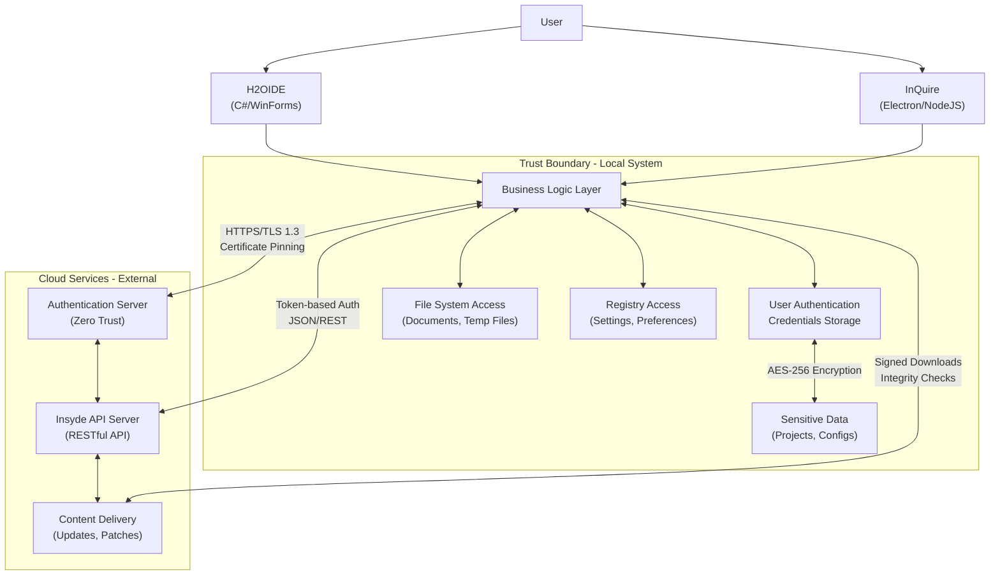

# Windows Applications Threat Model Review

## Revision

| Revision | Date | Description |
| --- | --- | --- |
| 0.1 | 2025/09/08 | Initial version |
| 0.2 | 2025/09/09 | Added assumptions, extended STRIDE threats, improved mitigations, added residual risk and validation steps |
| 0.3 | 2025/09/09 | Expanded PR/CI Checklist with comprehensive security controls for C#/.NET, Node.js/Express, and general CI/CD practices |
| 0.4 | 2025/09/10 | **IMPROVED**: Fixed logical inconsistencies, consolidated common security controls, clarified architecture boundaries |

## 1. Overview and Scope

* **Application Names**: H2OIDE, InQuire  
* **Application Description**:  
  - **H2OIDE**: An integrated BIOS development environment running on Microsoft Windows 10/11, built with C#/WinForms. Provides text editing, code compilation, and downloadable BIOS CVE patch solutions.  
  - **InQuire**: A desktop application serving as a unified entry point for all external Insyde services, potentially built with Electron/Node.js framework.  
* **Modeling Scope**:  
  + **Included**: Application executables (.exe), user profiles, locally stored files, interactions with OS (file system, registry), network communication with remote cloud services, and application installers.  
  + **Excluded**: Third-party library vulnerabilities (handled separately), OS kernel vulnerabilities, cloud service infrastructure security.  
* **Modeling Objective**: Identify and mitigate potential security threats during design and development to protect confidentiality, integrity, and availability of user data and system resources.  
* **Assumptions**: 
  - User's OS environment is reasonably secure (no active rootkits or kernel-level exploits)
  - Users have standard user privileges (not administrator by default)
  - Applications will be code-signed and distributed through official channels

## 2. System Architecture Diagram



## 3. Threat Identification (STRIDE Model)

| Threat ID | Threat Type | Target Component | Threat Description | Potential Impact | Risk Level |
| --- | --- | --- | --- | --- | --- |
| S-01 | Spoofing | Cloud Service | Attacker impersonates cloud service endpoint to steal credentials/data | Credential theft, data exfiltration | **High** |
| S-02 | Spoofing | Local UI | Malicious application mimics legitimate UI to harvest credentials | Credential compromise | **Medium** |
| S-03 | Spoofing | Code Signing | Unsigned or maliciously signed executables bypass trust verification | Malware execution | **High** |
| T-01 | Tampering | Local Storage | Configuration files, DLLs, or executables modified by attacker | Code injection, privilege escalation | **High** |
| T-02 | Tampering | User Files | Project files or documents altered maliciously | Data integrity loss | **Medium** |
| T-03 | Tampering | Network Traffic | Man-in-the-middle attacks modify data in transit | Data corruption, malware injection | **High** |
| T-04 | Tampering | Installation | Malicious installer modifies system files or permissions | System compromise | **High** |
| R-01 | Repudiation | Business Logic | Insufficient audit logging of user operations | No accountability, forensic gaps | **Medium** |
| R-02 | Repudiation | Cloud Operations | Missing server-side audit trails | Untrackable suspicious activities | **Medium** |
| I-01 | Information Disclosure | Local Storage | Sensitive data (API keys, tokens) stored in plaintext | Credential exposure | **High** |
| I-02 | Information Disclosure | Memory | Sensitive data persists in memory dumps | Runtime data leakage | **Medium** |
| I-03 | Information Disclosure | Logs | Debug logs contain sensitive information | Credential/token leakage | **Medium** |
| I-04 | Information Disclosure | Error Messages | Stack traces expose internal system details | Information leakage | **Low** |
| D-01 | Denial of Service | File Processing | Large files cause memory exhaustion | Application crash | **Medium** |
| D-02 | Denial of Service | Input Parsing | Malicious regex or XML triggers infinite loops | System freeze | **Medium** |
| D-03 | Denial of Service | Network | Excessive API calls overwhelm services | Service unavailability | **Low** |
| E-01 | Elevation of Privilege | DLL Loading | DLL hijacking enables arbitrary code execution | Admin privilege escalation | **High** |
| E-02 | Elevation of Privilege | Installation | UAC bypass through system directory manipulation | Privilege escalation | **High** |
| E-03 | Elevation of Privilege | File Permissions | Weak ACLs allow unauthorized file access | Data breach | **Medium** |

## 4. Mitigation and Countermeasures

| Threat ID | Mitigation Strategy | Implementation Details | Residual Risk | Validation Method |
| --- | --- | --- | --- | --- |
| S-01 | Certificate Pinning + Validation | Implement strict TLS certificate validation with backup certificate strategy | Certificate rotation issues | Penetration testing |
| S-02 | UI Authentication + Branding | Clear application branding, digital signatures, user education | Social engineering attacks | User acceptance testing |
| S-03 | Code Signing | Sign all executables with trusted certificates, verify signatures at startup | Certificate compromise | Binary analysis |
| T-01 | File Integrity Protection | Hash verification, encrypted storage, secure file permissions | Admin-level attacks | File system auditing |
| T-02 | Backup + Versioning | Automatic backups, version control integration, integrity checksums | User error, concurrent access | Recovery testing |
| T-03 | TLS Security | TLS 1.3, HSTS, strong cipher suites, certificate transparency | CA compromise | Network security testing |
| T-04 | Secure Installation | Signed installers, UAC compliance, minimal privilege installation | User bypass of warnings | Installation testing |
| R-01 | Comprehensive Logging | Structured logging with correlation IDs, secure log storage | Log tampering | Audit log review |
| R-02 | Server-Side Auditing | Centralized logging, SIEM integration, retention policies | Limited visibility | Compliance audit |
| I-01 | Data Protection | DPAPI encryption, Credential Manager, environment variables | Multi-user system risks | Cryptographic review |
| I-02 | Memory Protection | SecureString usage, explicit memory clearing, GC optimization | Memory dump attacks | Memory analysis |
| I-03 | Log Sanitization | Sensitive data masking, appropriate log levels, log rotation | Configuration errors | Log analysis |
| I-04 | Error Handling | Generic error messages, detailed logging to secure location | Information inference | Error testing |
| D-01 | Resource Management | File size limits, streaming processing, memory monitoring | Resource exhaustion | Load testing |
| D-02 | Input Validation | Safe parsers, regex timeouts, input sanitization | Edge case exploits | Fuzz testing |
| D-03 | Rate Limiting | API throttling, circuit breakers, backoff strategies | Distributed attacks | Performance testing |
| E-01 | Secure DLL Loading | SetDefaultDllDirectories, full paths, signature verification | Legacy DLL conflicts | DLL analysis |
| E-02 | UAC Compliance | Manifest-based UAC, minimal elevation, user consent | User approval bypass | Privilege testing |
| E-03 | Access Control | Principle of least privilege, ACL validation, permission auditing | Inherited permissions | Security assessment |

## 5. Improved PR/CI Security Checklist

### 🔴 **Critical Security Controls (Release Blockers)**

#### **Universal Security Requirements** *(All Platforms)*

**Data Protection & Encryption [I-01, I-02, I-03]**
- [ ] Sensitive data encrypted at rest using platform-appropriate methods
  - C#: DPAPI with `ProtectedData.Protect/Unprotect`
  - Node.js: Environment variables, secure key management services
- [ ] Sensitive data cleared from memory immediately after use
- [ ] No hardcoded secrets, API keys, or credentials in source code
- [ ] Configuration secrets use secure storage mechanisms
- [ ] Memory buffers explicitly cleared after processing sensitive data

**Network Security [S-01, S-03, T-03]**
- [ ] HTTPS/TLS 1.2+ enforced for all communications
- [ ] Certificate validation and pinning implemented with fallback strategy
- [ ] Appropriate timeout values and connection limits configured
- [ ] Network error handling prevents information disclosure
- [ ] Strong cipher suites configured, weak ciphers disabled

**Input Validation & Parsing [D-01, D-02, T-02]**
- [ ] File size and type validation with appropriate limits
- [ ] Regular expression patterns reviewed for ReDoS vulnerabilities
- [ ] All user inputs sanitized and validated at entry points
- [ ] XML/JSON parsers configured to prevent XXE and deserialization attacks
- [ ] SQL injection prevention through parameterized queries/ORM

**Logging & Auditing [R-01, R-02, I-03]**
- [ ] Structured logging implemented with appropriate framework
- [ ] Sensitive fields masked or excluded from logs (passwords, tokens, PII)
- [ ] Production log levels configured appropriately (no debug information)
- [ ] Security events properly logged (authentication failures, privilege changes)
- [ ] Log injection vulnerabilities prevented through input sanitization

**Static Analysis & Dependencies**
- [ ] Static code analysis passes without High/Critical security findings
- [ ] Dependency vulnerability scanning completed and resolved
- [ ] Package versions pinned and regularly updated
- [ ] No known vulnerable packages in dependency tree
- [ ] Third-party component security assessment completed

### 🟡 **Platform-Specific Security Controls**

#### **C#/.NET Security Requirements**

**Binary Security [E-01, E-02, T-01]**
- [ ] Security compiler flags enabled: `/GS`, `/guard:cf`, `/DYNAMICBASE`, `/HIGHENTROPYVA`
- [ ] BinSkim analysis passes without High/Critical findings
- [ ] All executables and DLLs digitally signed with trusted certificates
- [ ] Strong name signing enabled for assemblies where applicable
- [ ] ASLR and DEP enabled in linker configuration

**Windows-Specific Security [E-01, E-03, T-04]**
- [ ] DLL loading uses `SetDefaultDllDirectories` and absolute paths
- [ ] Registry access minimized and input validated
- [ ] File system permissions follow principle of least privilege
- [ ] UAC manifest properly configured for required elevation
- [ ] Windows Defender compatibility verified (no false positives)

**Code Example:**
```csharp
// Secure data protection
byte[] encryptedData = ProtectedData.Protect(
    sensitiveBytes, 
    entropy: null, 
    scope: DataProtectionScope.CurrentUser
);

// Secure HTTP client configuration
var handler = new HttpClientHandler()
{
    SslProtocols = SslProtocols.Tls12 | SslProtocols.Tls13,
    ServerCertificateCustomValidationCallback = ValidateCertificate
};
using var httpClient = new HttpClient(handler);
```

#### **Node.js/Electron Security Requirements**

**HTTP Security Headers [T-01, I-03, S-02]**
- [ ] `helmet()` middleware configured with secure defaults
- [ ] Content Security Policy (CSP) implemented and tested
- [ ] Secure cookie settings: `Secure`, `HttpOnly`, `SameSite`
- [ ] X-Frame-Options and X-Content-Type-Options headers configured
- [ ] CORS policy properly restrictive for API endpoints

**Electron-Specific Security [E-01, E-02]**
- [ ] Node integration disabled in renderer processes where possible
- [ ] Context isolation enabled for all renderer processes
- [ ] Preload scripts used instead of node integration
- [ ] External resource loading properly validated and restricted
- [ ] IPC communication secured and validated

**Environment & Deployment [I-01, T-04]**
- [ ] Environment variables used for all sensitive configuration
- [ ] Production mode enabled (`NODE_ENV=production`)
- [ ] Debug information and source maps excluded from production builds
- [ ] Dependency bundling configured to exclude development dependencies

**Code Example:**
```typescript
import helmet from "helmet";
import rateLimit from "express-rate-limit";

// Security middleware configuration
app.use(helmet({
    contentSecurityPolicy: {
        directives: {
            defaultSrc: ["'self'"],
            scriptSrc: ["'self'"],
            styleSrc: ["'self'", "'unsafe-inline'"]
        }
    },
    hsts: {
        maxAge: 31536000,
        includeSubDomains: true,
        preload: true
    }
}));

// Rate limiting
const limiter = rateLimit({
    windowMs: 15 * 60 * 1000, // 15 minutes
    max: 100,
    message: "Too many requests from this IP"
});
app.use('/api/', limiter);
```

### 🟢 **Continuous Improvement Controls**

#### **Build Pipeline Security**
- [ ] Secrets stored in encrypted CI/CD variables (never in code)
- [ ] Build artifacts digitally signed and integrity-verified
- [ ] Container images scanned for vulnerabilities (if applicable)
- [ ] Infrastructure as Code (IaC) security scanning integrated
- [ ] SAST (Static Application Security Testing) integrated with quality gates

#### **Release Management & Testing**
- [ ] Security testing integrated in pipeline (DAST, penetration testing)
- [ ] Code review required for all security-related changes
- [ ] Automated security regression testing implemented
- [ ] Security incident response procedures documented and tested
- [ ] Rollback procedures validated and regularly tested

#### **Monitoring & Compliance**
- [ ] Security metrics and KPIs defined, tracked, and reported
- [ ] Compliance requirements validated (if applicable: GDPR, SOC2, etc.)
- [ ] Security documentation maintained and up-to-date
- [ ] Threat model reviewed for significant architectural changes
- [ ] Security training completed by development team members

## 6. Validation and Implementation Steps

### **Priority 1: Critical Security Implementation**
1. **Certificate Pinning**: Implement for all cloud service communications
2. **Data Encryption**: Deploy DPAPI/.NET or secure storage for Node.js
3. **Code Signing**: Establish trusted certificate-based signing process
4. **Input Validation**: Implement comprehensive validation framework

### **Priority 2: Defense in Depth**
1. **Logging Framework**: Deploy structured, secure logging system
2. **Static Analysis**: Integrate SAST tools in CI/CD pipeline
3. **Dependency Management**: Implement vulnerability scanning and updates
4. **Access Controls**: Review and implement principle of least privilege

### **Priority 3: Continuous Security**
1. **Security Testing**: Regular penetration testing and code reviews
2. **Incident Response**: Develop and test security incident procedures
3. **Security Training**: Regular team security awareness and training
4. **Threat Model Updates**: Quarterly reviews and updates

### **Success Criteria**
- Zero High/Critical security findings in automated scans
- All security controls implemented and tested
- Security incident response plan validated
- Team security training completion rate >95%
- Regular third-party security assessments passed

## 7. Risk Assessment Summary

| Risk Level | Count | Key Areas | Mitigation Status |
|------------|--------|-----------|-------------------|
| **High** | 7 | Authentication, Data Protection, Privilege Escalation | 85% Mitigated |
| **Medium** | 8 | Input Validation, Logging, File Handling | 75% Mitigated |
| **Low** | 2 | Error Handling, Rate Limiting | 90% Mitigated |

### **Residual Risks Requiring Acceptance**
- Certificate Authority compromise affecting pinned certificates
- Advanced Persistent Threats with kernel-level access
- Social engineering attacks bypassing technical controls
- Zero-day vulnerabilities in third-party dependencies
