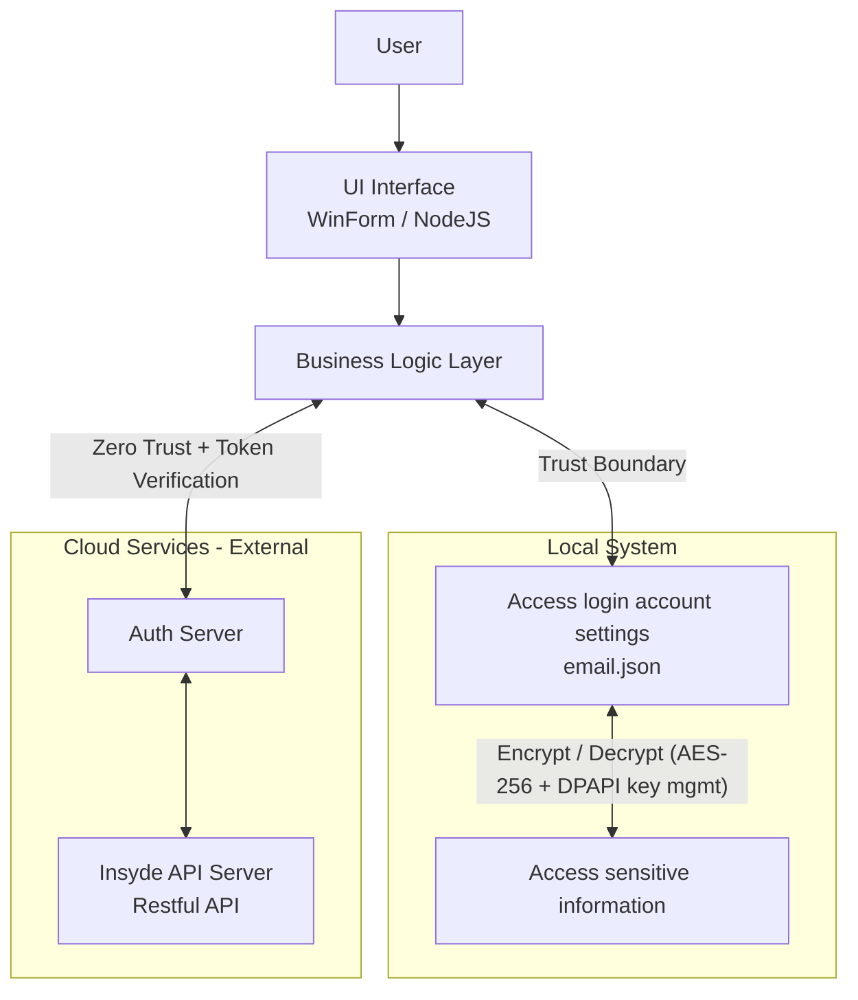

# Windows Applications Threat Model Review

## Revision

| Revision | Date | Description |
| --- | --- | --- |
| 0.1 | 2025/09/09 | Initial version |
| 0.2 | 2025/09/08 | Added assumptions, extended STRIDE threats, improved mitigations, added residual risk and validation steps |
| 0.3 | 2025/09/09 | Expanded PR/CI Checklist with comprehensive security controls for C#/.NET, Node.js/Express, and general CI/CD practices |

## 1. Overview and Scope

*   Application Names: H2OIDE, InQuire  
*   Application Description:  
    - **H2OIDE** is an integrated BIOS development environment running on Microsoft Windows 10/11. It provides text editing, code compilation, and downloadable BIOS CVE patch solutions.  
    - **InQuire** is a desktop application that serves as a unified entry point for all external Insyde services.  
*   Modeling Scope:  
	+   Included: The application itself (.exe), user profiles, locally stored files, interactions with the OS (file system, registry), and (if applicable) network communication with remote cloud services.  
	+   Excluded: Distribution websites, third-party installers (e.g., InnoSetup, MSI), vulnerabilities in the OS kernel itself.  
        (**Note**: If an installer is tampered with, it may indirectly affect application file permissions or DLL integrity.)  
*   Modeling Objective: Identify and mitigate potential security threats during design and development to protect confidentiality, integrity, and availability of user data.  
*   Assumptions: The user’s OS environment is free from rootkits and kernel-level exploits.  

## 2. System Architecture Diagram



*   **Components:**  
	+   **User:** The entity interacting with the application.  
	+   **UI Interface (WinForms/NodeJS):** The primary application interface.  
	+   **Business Logic Layer:** BIOS code editing/compilation, version control, visual components, login/session management.  
	+   **Local Data Storage:**  
		- **Trust Boundary:** From the application process to features requiring account login.  
		- **Data Flow:** The application uses Windows APIs to read/write files (e.g., saved documents).  
	+   **Cloud Services:**  
		- **Zero Trust:** Every access requires credentials and token.  
		- **Data Flow:** All communication via HTTPS; request/response bodies are encrypted.  

## 3. Threat Identification (STRIDE Model)

| Threat Type | Target Component | Threat Description | Potential Impact |
| --- | --- | --- | --- |
| Spoofing | Cloud Service | Attacker forges cloud service endpoint to trick app into sending sensitive data. | Credential and document leakage |
| Spoofing | Local UI | Fake UI or malware mimics login screen to steal credentials. | Credential leakage |
| Tampering | Local Storage | Config file or DLL is modified. | Malicious code execution |
| Tampering | Local Files | User documents are altered. | Loss of integrity |
| Tampering | Network Traffic | MITM modifies uploaded/downloaded files. | Data corruption or malware injection |
| Repudiation | Business Logic | Lack of operation logs. | No audit trail or accountability |
| Repudiation | Cloud Service | No cloud operation logs (e.g., downloads). | Suspicious activity cannot be tracked |
| Information Disclosure | Local Storage | API keys stored in plaintext. | Sensitive data leakage |
| Information Disclosure | Memory | Sensitive data not cleared. | Memory dump leakage |
| Information Disclosure | Logs | Logs contain sensitive data. | Token/credential leakage |
| Denial of Service | Business Logic | Opening large files exhausts memory. | Application crash |
| Denial of Service | Parser/Regex | Malicious input triggers infinite loop/Regex DoS. | System freeze |
| Elevation of Privilege | DLL/Config Loading | DLL hijacking. | Admin privilege escalation |
| Elevation of Privilege | Installation | UAC bypass via system directory writes. | Privilege escalation |

## 4. Mitigation and Countermeasures

| Threat ID | Description | Mitigation & Security Controls | Severity (H/M/L) | Residual Risk |
| --- | --- | --- | --- | --- |
| S-01 | Spoofed Cloud Service | Strict certificate validation & pinning; certificate update & fallback strategy. | H | Risk if user ignores updates |
| S-02 | Fake UI | Clear branding; limit unnecessary NodeJS privileges. | M | Social engineering risk remains |
| T-01 | Config/DLL Tampering | Sign executables/DLLs; encrypt & hash configs. | M | Outdated signatures may fail |
| T-02 | File Tampering | Store in protected directories; encrypt & hash sensitive files. | M | Weak default Windows ACLs |
| T-03 | Network Tampering | TLS 1.3 + HSTS; avoid weak ciphers. | H | CA compromise risk |
| R-01 | Missing Logs | Use log4net/NLog; secure log storage. | M | Logs may still be deleted |
| R-02 | Missing Cloud Audit | Cloud endpoints must log operations. | M | Limited if logs not centralized |
| I-01 | Plaintext Sensitive Data | Use DPAPI or Credential Manager; key rotation. | H | Multi-user systems risk |
| I-02 | Memory Disclosure | Use SecureString, clear buffers promptly. | M | Memory dumps still risky |
| I-03 | Log Disclosure | Mask or encrypt sensitive data in logs. | M | Misconfigured log levels risk |
| D-01 | Large File DoS | File size/type checks; stream processing. | M | High concurrency DoS still possible |
| D-02 | Regex DoS | Safe parser or regex limits. | M | Special cases may still hang system |
| E-01 | DLL Hijacking | Use SetDefaultDllDirectories, absolute paths; avoid running as admin. | H | Old DLLs may persist |
| E-02 | UAC Bypass | Require system writes only when necessary; follow UAC guidelines. | H | User approval risk |

## 5. Validation and Next Steps

*   **Code Review:** Focus on High severity threats (S-01, T-03, I-01, E-01, E-02).  
*   **Penetration Testing:** Simulate DLL tampering, MITM attacks, UAC bypass.  
*   **Fuzz Testing:** Validate parser/regex against malicious input.  
*   **Third-Party Dependency Scan:** Use `npm audit`, `NuGet audit`.  
*   **Success Criteria:** No unresolved High severity findings in CI pipeline.  

### 5.1 Self-Check Guidelines

1) **Do not store sensitive data in plaintext, use DPAPI** [I-01]  
```csharp
using System.Security.Cryptography;

byte[] plain = System.Text.Encoding.UTF8.GetBytes(secret);
byte[] cipher = ProtectedData.Protect(plain, optionalEntropy: null, scope: DataProtectionScope.CurrentUser);
// Save cipher; use Unprotect when needed
```

2) **HTTPS/TLS:** Do not hardcode TLS version  
	- Let .NET negotiate per OS policy (avoid hardcoding `ServicePointManager.SecurityProtocol`). [S-01/I-01]  
	- Only accept TLS 1.2+ in production. [S-01/I-01]  
	- In Node, set `minVersion: 'TLSv1.2'`.  

3) **Auditable Logs without Sensitive Data**  
	- Use EventSource [R-01], custom events, never log tokens/passwords.  

4) **Secure Compile/Link Options (esp. x64)**  
	- `/GS` [E-01/T-01], `/guard:cf` [E-01], `/DYNAMICBASE` [E-01], `/HIGHENTROPYVA` [E-01]  
	- Run BinSkim in CI for binary checks.  

5) **Static Code Scanning**  
	- Deploy DevSkim in VS Code/GitHub Actions.  

6) **HTTP Headers & Common Protections**  
	- Use `helmet()`, secure cookies (Secure, HttpOnly, SameSite), set CSP.  

7) **Minimize Logs, Avoid Sensitive Content**  
	- Do not log Authorization headers/tokens.  

**Example (Express):**
```ts
import express from "express";
import helmet from "helmet";

const app = express();
app.use(helmet() [T-01/I-01]);
app.use(express.json());

app.get("/health", (_, res) => res.send("ok"));

app.post("/token/use", (req, res) => {
  const { userId } = req.body;
  console.info({ evt: "token_use", userId });
  res.sendStatus(204);
});

app.listen(3000);
```

## PR / CI Checklist

### **C# / .NET Security Checklist**
**Data Protection & Encryption [I-01, I-02]**
- [ ] DPAPI used for encryption with `ProtectedData.Protect/Unprotect`
- [ ] Sensitive strings use `SecureString` class where possible
- [ ] Memory buffers cleared after use (`Array.Clear`, `GC.Collect`)
- [ ] No hardcoded secrets, API keys, or connection strings in source code
- [ ] Configuration secrets use User Secrets or Azure Key Vault

**Network Security [S-01, T-03]**
- [ ] No hardcoded `SecurityProtocol` or `SslProtocols` (let .NET negotiate)
- [ ] Certificate validation enabled and certificate pinning implemented
- [ ] HTTPS-only communication enforced
- [ ] HttpClient configured with appropriate timeout values
- [ ] Custom certificate validation logic reviewed and tested

**Logging & Auditing [R-01, I-03]**
- [ ] EventSource or structured logging (Serilog/NLog) implemented
- [ ] Sensitive fields masked in logs (passwords, tokens, PII)
- [ ] Log levels appropriately configured (no Debug logs in production)
- [ ] Log injection vulnerabilities prevented (input sanitization)

**Binary Security [E-01, T-01]**
- [ ] Security compiler flags enabled: `/GS`, `/guard:cf`, `/DYNAMICBASE`, `/HIGHENTROPYVA`
- [ ] BinSkim analysis passed without High severity findings
- [ ] Code signing certificates applied to all executables and DLLs
- [ ] Strong name signing enabled for assemblies
- [ ] ASLR and DEP enabled in linker options

**Input Validation & Parsing [D-01, D-02]**
- [ ] File size and type validation implemented
- [ ] Regex patterns reviewed for ReDoS vulnerabilities
- [ ] Input sanitization for all user-provided data
- [ ] XML/JSON parsers configured to prevent XXE and deserialization attacks
- [ ] SQL injection prevention (parameterized queries/ORM)

**Static Analysis & Dependencies**
- [ ] DevSkim shows no High/Critical severity findings
- [ ] SonarQube/CodeQL analysis passed
- [ ] NuGet packages audited with `dotnet list package --vulnerable`
- [ ] Dependency versions pinned and regularly updated
- [ ] No known vulnerable packages in dependency tree

**Access Control & Privileges [E-01, E-02]**
- [ ] Application runs with minimal required privileges
- [ ] UAC prompts only when absolutely necessary
- [ ] File system permissions follow principle of least privilege
- [ ] Registry access minimized and validated
- [ ] DLL loading uses secure methods (SetDefaultDllDirectories, full paths)

### **Node.js / Express Security Checklist**
**Network & Transport Security [S-01, T-03]**
- [ ] TLS 1.2+ enforced (`minVersion: 'TLSv1.2'` in HTTPS options)
- [ ] Certificate validation and pinning implemented
- [ ] HSTS headers configured with appropriate max-age
- [ ] Certificate transparency monitoring enabled
- [ ] Request timeout and rate limiting configured

**HTTP Security Headers [T-01, I-03]**
- [ ] `helmet()` middleware configured with secure defaults
- [ ] Content Security Policy (CSP) implemented and tested
- [ ] Secure cookie settings: `Secure`, `HttpOnly`, `SameSite`
- [ ] X-Frame-Options, X-Content-Type-Options headers set
- [ ] Referrer-Policy configured appropriately

**Authentication & Session Management [S-02, I-01]**
- [ ] JWT tokens properly validated and signed
- [ ] Session secrets stored securely (environment variables/secrets manager)
- [ ] Token expiration and refresh mechanisms implemented
- [ ] CSRF protection enabled for state-changing operations
- [ ] Authentication rate limiting implemented

**Input Validation & Sanitization [D-01, D-02, T-02]**
- [ ] Request body size limits configured
- [ ] File upload restrictions (type, size, location)
- [ ] Input validation middleware (Joi, express-validator)
- [ ] SQL injection prevention (parameterized queries)
- [ ] XSS protection and output encoding

**Logging & Monitoring [R-01, I-03]**
- [ ] Structured logging implemented (Winston, Bunyan)
- [ ] Sensitive data masked in logs (Authorization headers, passwords)
- [ ] Security events logged (failed logins, privilege escalations)
- [ ] Log rotation and secure storage configured
- [ ] Monitoring and alerting for security events

**Dependencies & Static Analysis**
- [ ] `npm audit` shows no High/Critical vulnerabilities
- [ ] Package versions pinned in package-lock.json
- [ ] ESLint security rules enabled (eslint-plugin-security)
- [ ] Snyk or similar dependency scanning in CI pipeline
- [ ] Regular dependency updates scheduled

**Environment & Deployment [E-01, E-02]**
- [ ] Environment variables used for all configuration
- [ ] Production mode enabled (`NODE_ENV=production`)
- [ ] Debug information disabled in production builds
- [ ] Source maps excluded from production deployments
- [ ] Docker images use non-root user and minimal base images

### **General CI/CD Security Checklist**
**Build Pipeline Security**
- [ ] Secrets stored in secure CI/CD variables (encrypted)
- [ ] Build artifacts signed and integrity-verified
- [ ] Container images scanned for vulnerabilities
- [ ] Infrastructure as Code (IaC) security scanned
- [ ] SAST (Static Application Security Testing) integrated

**Release Management**
- [ ] Security testing included in pipeline (DAST, penetration testing)
- [ ] Code review required for all security-related changes
- [ ] Automated security regression testing
- [ ] Rollback procedures documented and tested
- [ ] Security incident response plan validated

**Monitoring & Compliance**
- [ ] Security metrics and KPIs defined and tracked
- [ ] Compliance requirements validated (if applicable)
- [ ] Security documentation updated
- [ ] Threat model review completed for significant changes
- [ ] Security training completed for development team

### **Priority Levels**
- **🔴 Critical (Must Fix)**: High severity security findings that block release
- **🟡 High Priority**: Security improvements that should be addressed soon
- **🟢 Nice to Have**: Security enhancements for future consideration